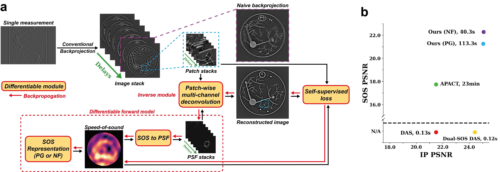

# Self-Supervised Speed of Sound Recovery for Aberration-Corrected Photoacoustic Computed Tomography

<b>[Tianao Li](https://lukeli0425.github.io)</b><sup>1</sup>, <b>Manxiu Cui</b><sup>2</sup>, <b>[Cheng Ma](https://rachmaninov-ma.wixsite.com/mysite)</b><sup>3</sup>, <b>[Emma Alexander](https://www.alexander.vision/emma)</b><sup>1</sup><br>
<sup>1</sup>Northwestern University, <sup>2</sup>Caltech, <sup>3</sup>Tsinghua University<br>
__In Submission__

[](https://lukeli0425.github.io/NF-APACT)&nbsp;
[](https://arxiv.org/abs/2409.10876)&nbsp;
[](./LICENSE)&nbsp;

Official code for [_Self-Supervised Speed of Sound Recovery for Aberration-Corrected
Photoacoustic Computed Tomography_](https://lukeli0425.github.io/NF-APACT).



## Get Started

To clone this project, run:

```zsh
git clone https://github.com/Lukeli0425/NF-APACT.git
```

Create a virtual environment and download the required packages:

```zsh
pip install -r requirements.txt
```

## Run Reconstruction

Use [`reconstruction.py`](reconstruction.py) to run reconstructions on our numerical phantom with selected method (choose from `'NF', 'PG', 'APACT', 'Deconv', 'Dual-SOS_DAS', 'DAS'`). The reconstruction parameters and data file paths are set in [`config.yaml`](config.yaml). To run our method, use
```bash
python reconstruction.py --task numerical --method NF --n_delays 32 --lam_tv 5e-5 --n_epochs 10 --batch_size 64 --lr 1e-3
```
The suggested parameters are set as default. 

To run APACT, use
```bash
python reconstruction.py --task numerical --method APACT --n_delays 32 --lam_tsv 5e-15 --n_iters 10
```

To run multi-channel deconvolution (see Section II-B of the paper, and note that this methods requires an SOS for PSF calculation), use
```bash
python reconstruction.py --task numerical --method Deconv --n_delays 32 --batch_size 64
```

To run DAS and conventional DAS, use 
```bash
python reconstruction.py --task numerical --method DAS --v_das 1510.0
python reconstruction.py --task numerical --method Dual-SOS_DAS --v_body 1560.0
```


### Numerical Phantom

We created a numerical phantom to test our method in [`notebooks/create_phantom.ipynb`](notebooks/create_phantom.ipynb). You can customize it to create your own, the initial pressure and SOS will be saved in the [`data`](data) folder.


### Citation

```bibtex
@article{li2024neural,
  title={Neural Fields for Adaptive Photoacoustic Computed Tomography},
  author={Li, Tianao and Cui, Manxiu and Ma, Cheng and Alexander, Emma},
  journal={arXiv preprint arXiv:2409.10876},
  year={2024}
}
```

### Acknowledgment

We would like to thank Liujie Gu and Yan Luo for helping us with the numerical simulations.

